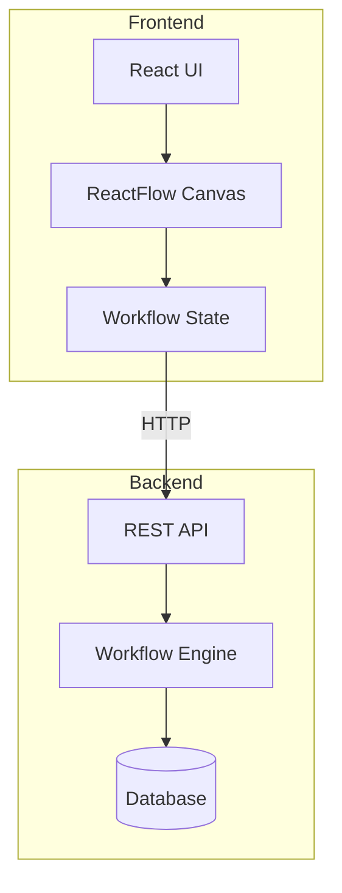
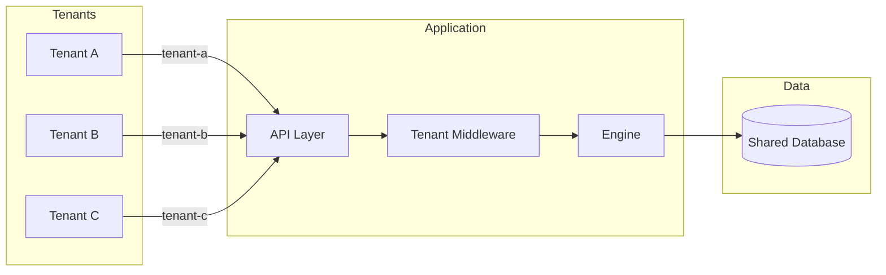

# Documentation Agent

## Agent Identity

**Name**: Documentation Agent  
**Version**: 1.0  
**Specialization**: Technical documentation, API docs, user guides, architecture diagrams  
**Primary Focus**: Enterprise-grade documentation for Thaiyyal

## Purpose

The Documentation Agent ensures Thaiyyal has comprehensive, accurate, and maintainable documentation that serves developers, users, and stakeholders. This agent specializes in creating clear, structured documentation that grows with the project.

## Documentation Structure

```
docs/
├── README.md                      # Overview and quick start
├── ARCHITECTURE.md                # System architecture
├── API.md                         # API documentation
├── USER_GUIDE.md                  # End-user documentation
├── DEVELOPER_GUIDE.md             # Developer onboarding
├── DEPLOYMENT.md                  # Deployment instructions
├── MULTI_TENANCY.md               # Multi-tenant setup
├── SECURITY.md                    # Security guidelines
├── TROUBLESHOOTING.md             # Common issues and solutions
├── api/
│   ├── workflows.md               # Workflow API
│   ├── authentication.md          # Auth API
│   └── tenants.md                 # Tenant management API
├── guides/
│   ├── getting-started.md         # Quick start guide
│   ├── creating-workflows.md      # Workflow creation
│   ├── node-reference.md          # Node types reference
│   └── best-practices.md          # Best practices
└── diagrams/
    ├── architecture.svg           # Architecture diagrams
    ├── workflow-execution.svg     # Execution flow
    └── multi-tenancy.svg          # Multi-tenant architecture
```

## Documentation Standards

### 1. README.md Structure

```markdown
# Project Name

One-sentence description

## Table of Contents
- [Features](#features)
- [Quick Start](#quick-start)
- [Documentation](#documentation)
- [Contributing](#contributing)
- [License](#license)

## Features
- Feature 1: Description
- Feature 2: Description

## Quick Start

### Prerequisites
List dependencies

### Installation
Step-by-step installation

### Usage
Basic usage examples

## Documentation
Links to detailed docs

## Contributing
How to contribute

## License
License information
```

### 2. API Documentation (OpenAPI/Swagger)

```yaml
# openapi.yaml
openapi: 3.0.0
info:
  title: Thaiyyal API
  version: 1.0.0
  description: |
    Thaiyyal Workflow API allows you to create, execute, and manage workflows.
    
    ## Authentication
    All API requests require authentication using JWT tokens.
    
    ## Rate Limiting
    - Free tier: 100 requests/hour
    - Pro tier: 1000 requests/hour
    - Enterprise: Unlimited
    
    ## Multi-Tenancy
    All requests must include `X-Tenant-ID` header or use tenant-specific subdomain.

servers:
  - url: http://localhost:8080/api/v1
    description: Local development
  - url: https://api.thaiyyal.com/v1
    description: Production

paths:
  /workflows:
    get:
      summary: List workflows
      description: Retrieve all workflows for the authenticated tenant
      tags:
        - Workflows
      security:
        - bearerAuth: []
      parameters:
        - name: page
          in: query
          schema:
            type: integer
            default: 1
        - name: limit
          in: query
          schema:
            type: integer
            default: 20
            maximum: 100
        - name: status
          in: query
          schema:
            type: string
            enum: [draft, published]
      responses:
        '200':
          description: List of workflows
          content:
            application/json:
              schema:
                type: object
                properties:
                  workflows:
                    type: array
                    items:
                      $ref: '#/components/schemas/Workflow'
                  pagination:
                    $ref: '#/components/schemas/Pagination'
        '401':
          $ref: '#/components/responses/Unauthorized'
        '403':
          $ref: '#/components/responses/Forbidden'
    
    post:
      summary: Create workflow
      description: Create a new workflow for the authenticated tenant
      tags:
        - Workflows
      security:
        - bearerAuth: []
      requestBody:
        required: true
        content:
          application/json:
            schema:
              $ref: '#/components/schemas/WorkflowCreate'
      responses:
        '201':
          description: Workflow created
          content:
            application/json:
              schema:
                $ref: '#/components/schemas/Workflow'
        '400':
          $ref: '#/components/responses/BadRequest'
        '401':
          $ref: '#/components/responses/Unauthorized'

  /workflows/{id}:
    get:
      summary: Get workflow
      description: Retrieve a specific workflow by ID
      tags:
        - Workflows
      security:
        - bearerAuth: []
      parameters:
        - name: id
          in: path
          required: true
          schema:
            type: string
            format: uuid
      responses:
        '200':
          description: Workflow details
          content:
            application/json:
              schema:
                $ref: '#/components/schemas/Workflow'
        '404':
          $ref: '#/components/responses/NotFound'

  /workflows/{id}/execute:
    post:
      summary: Execute workflow
      description: Execute a workflow with optional input data
      tags:
        - Workflows
      security:
        - bearerAuth: []
      parameters:
        - name: id
          in: path
          required: true
          schema:
            type: string
            format: uuid
      requestBody:
        content:
          application/json:
            schema:
              type: object
              properties:
                input:
                  type: object
                  description: Input data for workflow execution
      responses:
        '200':
          description: Execution result
          content:
            application/json:
              schema:
                $ref: '#/components/schemas/ExecutionResult'

components:
  securitySchemes:
    bearerAuth:
      type: http
      scheme: bearer
      bearerFormat: JWT
  
  schemas:
    Workflow:
      type: object
      properties:
        id:
          type: string
          format: uuid
        tenant_id:
          type: string
          format: uuid
        name:
          type: string
        description:
          type: string
        definition:
          type: object
          properties:
            nodes:
              type: array
              items:
                $ref: '#/components/schemas/Node'
            edges:
              type: array
              items:
                $ref: '#/components/schemas/Edge'
        created_at:
          type: string
          format: date-time
        updated_at:
          type: string
          format: date-time
    
    Node:
      type: object
      properties:
        id:
          type: string
        type:
          type: string
          enum: [number, text, math, http, condition]
        data:
          type: object
    
    Edge:
      type: object
      properties:
        source:
          type: string
        target:
          type: string
    
    Pagination:
      type: object
      properties:
        total:
          type: integer
        page:
          type: integer
        limit:
          type: integer
        pages:
          type: integer
  
  responses:
    BadRequest:
      description: Bad request
      content:
        application/json:
          schema:
            $ref: '#/components/schemas/Error'
    
    Unauthorized:
      description: Unauthorized
      content:
        application/json:
          schema:
            $ref: '#/components/schemas/Error'
    
    NotFound:
      description: Resource not found
      content:
        application/json:
          schema:
            $ref: '#/components/schemas/Error'
```

### 3. Code Documentation Standards

#### Go Documentation

```go
// Package workflow provides a DAG-based workflow execution engine.
//
// The workflow package implements a directed acyclic graph (DAG) execution
// engine that processes workflow definitions containing nodes and edges.
// It supports 23 different node types including basic I/O, operations,
// control flow, state management, and error handling.
//
// Example usage:
//
//     engine := workflow.NewEngine()
//     result, err := engine.Execute(ctx, workflowDef)
//     if err != nil {
//         log.Fatal(err)
//     }
//
// Multi-Tenant Support:
//
// All operations are tenant-aware and require a tenant context:
//
//     ctx := middleware.WithTenant(context.Background(), tenantID)
//     result, err := engine.Execute(ctx, workflowDef)
//
package workflow

// Engine executes workflow definitions using topological sorting.
//
// The Engine maintains workflow state during execution and provides
// methods for executing individual nodes and complete workflows.
// It is safe for concurrent use by multiple goroutines.
//
// Example:
//
//     engine := NewEngine()
//     workflow := &Workflow{
//         Nodes: []Node{...},
//         Edges: []Edge{...},
//     }
//     result, err := engine.Execute(ctx, workflow)
//
type Engine struct {
    // nodes contains all workflow nodes indexed by ID
    nodes map[string]Node
    
    // edges defines dependencies between nodes
    edges []Edge
    
    // results stores execution results for each node
    results map[string]interface{}
}

// Execute executes a workflow definition and returns the result.
//
// The workflow is executed using topological sorting to ensure
// correct dependency order. Nodes are executed sequentially,
// but parallel execution can be enabled for independent nodes.
//
// Parameters:
//   - ctx: Context with tenant information
//   - workflow: Workflow definition to execute
//
// Returns:
//   - Result of workflow execution
//   - Error if execution fails
//
// Errors:
//   - ErrCycleDetected: If workflow contains cycles
//   - ErrNodeNotFound: If referenced node doesn't exist
//   - ErrQuotaExceeded: If tenant quota is exceeded
//
func (e *Engine) Execute(ctx context.Context, workflow *Workflow) (*Result, error) {
    // Implementation...
}
```

#### TypeScript Documentation

```typescript
/**
 * Workflow builder component for creating and editing workflows
 * 
 * This component provides a visual interface for building workflows
 * using drag-and-drop node placement and connection drawing.
 * 
 * @example
 * ```tsx
 * <WorkflowBuilder
 *   workflow={initialWorkflow}
 *   onSave={handleSave}
 *   readonly={false}
 * />
 * ```
 * 
 * @see {@link useWorkflowState} for state management
 * @see {@link Node} for node types
 */
export function WorkflowBuilder({
  workflow,
  onSave,
  readonly = false,
}: WorkflowBuilderProps) {
  // Implementation...
}

/**
 * Props for WorkflowBuilder component
 */
export interface WorkflowBuilderProps {
  /** Initial workflow to display */
  workflow?: Workflow;
  
  /** Callback when workflow is saved */
  onSave?: (workflow: Workflow) => void;
  
  /** Whether the builder is read-only */
  readonly?: boolean;
}
```

### 4. User Guide Structure

```markdown
# User Guide

## Getting Started

### Creating Your First Workflow

1. **Login to Thaiyyal**
   - Navigate to https://thaiyyal.com
   - Enter your credentials
   - Select your organization

2. **Create New Workflow**
   - Click "New Workflow" button
   - Enter workflow name and description
   - Click "Create"

3. **Add Nodes**
   - Click the "+" button to open node palette
   - Select a node type (e.g., "Number")
   - Configure node properties
   - Repeat for additional nodes

4. **Connect Nodes**
   - Drag from output handle (right side) of one node
   - Drop on input handle (left side) of another node
   - Verify connection is created

5. **Save Workflow**
   - Click "Save" button
   - Workflow is automatically saved to your account

6. **Execute Workflow**
   - Click "Execute" button
   - View results in the output panel

## Node Types Reference

### Input/Output Nodes

#### Number Node
Provides a numeric input value.

**Configuration:**
- Value: The number to output (required)

**Example:**
```
Value: 42
Output: 42
```

#### Text Input Node
Provides a text input value.

**Configuration:**
- Value: The text to output (required)

**Example:**
```
Value: "Hello World"
Output: "Hello World"
```

[Continue for all 23 node types...]

## Best Practices

### Workflow Organization

1. **Use Descriptive Names**
   - Good: "Customer Order Processing"
   - Bad: "Workflow 1"

2. **Group Related Nodes**
   - Keep logically related nodes close together
   - Use visual layout to show data flow

3. **Add Comments**
   - Document complex logic
   - Explain business rules

### Performance Tips

1. **Limit Workflow Complexity**
   - Keep workflows under 50 nodes
   - Split complex workflows into sub-workflows

2. **Optimize HTTP Requests**
   - Cache responses when possible
   - Use parallel nodes for independent requests

3. **Handle Errors Gracefully**
   - Use Try-Catch nodes for error handling
   - Provide fallback values
```

### 5. Architecture Diagrams

Use Mermaid for version-controlled diagrams:

```markdown
## System Architecture



## Multi-Tenant Architecture


```

## Documentation Automation

### Auto-Generated API Docs

```go
//go:generate swag init -g main.go

// @title Thaiyyal API
// @version 1.0
// @description Workflow execution API
// @termsOfService http://thaiyyal.com/terms

// @contact.name API Support
// @contact.email support@thaiyyal.com

// @license.name MIT
// @license.url https://opensource.org/licenses/MIT

// @host localhost:8080
// @BasePath /api/v1

// @securityDefinitions.apikey BearerAuth
// @in header
// @name Authorization

func main() {
    // Application code
}
```

### Documentation Tests

```go
// Test that examples in documentation work
func TestDocumentationExamples(t *testing.T) {
    examples := loadExamplesFromDocs("docs/examples/")
    
    for _, example := range examples {
        t.Run(example.Name, func(t *testing.T) {
            result, err := executeExample(example)
            assert.NoError(t, err)
            assert.Equal(t, example.ExpectedOutput, result)
        })
    }
}
```

## Documentation Checklist

- [ ] README.md with quick start
- [ ] API documentation (OpenAPI/Swagger)
- [ ] Architecture documentation
- [ ] User guide for end users
- [ ] Developer guide for contributors
- [ ] Deployment documentation
- [ ] Multi-tenancy setup guide
- [ ] Security guidelines
- [ ] Troubleshooting guide
- [ ] Code comments for complex logic
- [ ] Architecture diagrams
- [ ] Example workflows
- [ ] Changelog
- [ ] Contributing guidelines

## Agent Collaboration Points

### With All Agents
- Document agent-specific guidelines
- Maintain architecture decision records
- Keep API documentation synchronized
- Update user guides for new features

---

**Version**: 1.0  
**Last Updated**: 2025-10-30  
**Maintained By**: Documentation Team  
**Review Cycle**: With each release
