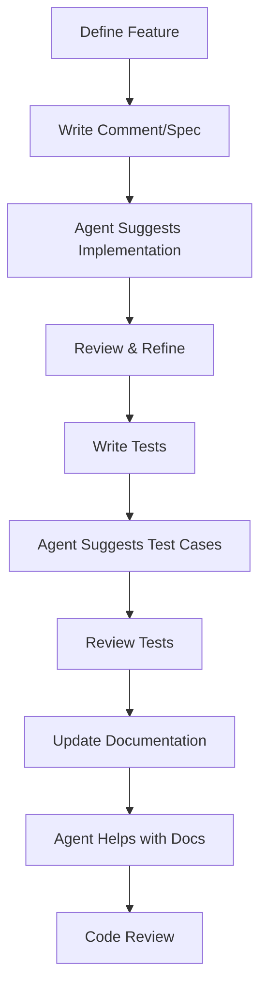
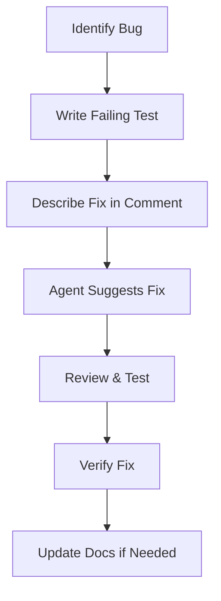
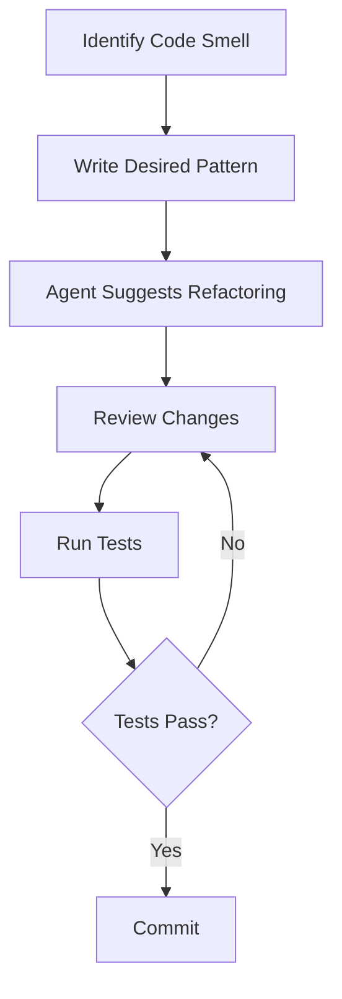

# Agent System Documentation

This document describes the agent system used in Thaiyyal's development and automation workflow.

## Overview

Thaiyyal uses AI-powered agents to assist with various development tasks, from code generation to documentation updates. These agents are integrated into the development workflow to improve productivity and code quality.

## Available Agents

Currently, the Thaiyyal project utilizes GitHub Copilot as the primary agent system for:

### Code Generation
- Implementing new node executors
- Creating test cases
- Writing boilerplate code
- Generating type-safe interfaces

### Documentation
- Generating API documentation
- Creating usage examples
- Updating README files
- Writing inline code comments

### Code Review
- Identifying potential bugs
- Suggesting optimizations
- Ensuring code style compliance
- Detecting security vulnerabilities

## Using Agents in Development

### GitHub Copilot Integration

#### Setup

1. **Install GitHub Copilot Extension**
   - VS Code: Install "GitHub Copilot" extension
   - Enable Copilot in your IDE settings

2. **Configure for Thaiyyal**
   ```json
   // .vscode/settings.json
   {
     "github.copilot.enable": {
       "*": true,
       "go": true,
       "typescript": true,
       "typescriptreact": true
     }
   }
   ```

#### Common Use Cases

**1. Generating Node Executors**

```go
// Type a comment describing the node
// Execute an HTTP request with retry logic and timeout protection
// Copilot will suggest the implementation
```

**2. Writing Tests**

```go
// Type the test function signature
func TestMyCustomExecutor(t *testing.T) {
    // Copilot suggests test cases based on executor implementation
}
```

**3. Creating Documentation**

```markdown
<!-- Describe what you want -->
## API Reference for Custom Node

<!-- Copilot suggests documentation structure and content -->
```

### Best Practices with Agents

#### Do's ✅

1. **Provide Clear Context**
   - Write descriptive comments
   - Use meaningful variable names
   - Structure code logically

2. **Review Suggestions**
   - Always review generated code
   - Verify logic correctness
   - Check for security issues
   - Ensure test coverage

3. **Iterative Refinement**
   - Use suggestions as starting point
   - Refine and improve generated code
   - Add proper error handling
   - Include edge cases

4. **Maintain Code Style**
   - Ensure suggestions follow project conventions
   - Run formatters and linters
   - Check against style guide

#### Don'ts ❌

1. **Don't Blindly Accept**
   - Review all suggestions carefully
   - Verify correctness and security
   - Test thoroughly

2. **Don't Skip Documentation**
   - Document generated code
   - Add meaningful comments
   - Update relevant docs

3. **Don't Ignore Tests**
   - Write tests for generated code
   - Ensure adequate coverage
   - Test edge cases

4. **Don't Compromise Security**
   - Validate all inputs
   - Check for vulnerabilities
   - Follow security best practices

## Custom Agent Patterns

### Node Executor Generation Pattern

When creating a new node executor, follow this pattern:

```go
// 1. Define the executor structure
type CustomExecutor struct {
    // Required dependencies
}

// 2. Implement NodeExecutor interface
func (e *CustomExecutor) Type() types.NodeType {
    return types.NodeTypeCustom
}

func (e *CustomExecutor) Execute(ctx ExecutionContext, node types.Node) (interface{}, error) {
    // Validate inputs
    // Process data
    // Return result
}

func (e *CustomExecutor) Validate(node types.Node) error {
    // Validate node configuration
}

// 3. Write comprehensive tests
func TestCustomExecutor(t *testing.T) {
    // Table-driven tests
    // Edge cases
    // Error handling
}
```

### Middleware Generation Pattern

```go
// 1. Define middleware structure
type CustomMiddleware struct {
    config Config
}

// 2. Implement Middleware interface
func (m *CustomMiddleware) Process(ctx ExecutionContext, node types.Node, next Handler) (interface{}, error) {
    // Pre-processing
    result, err := next(ctx, node)
    // Post-processing
    return result, err
}

func (m *CustomMiddleware) Name() string {
    return "CustomMiddleware"
}

// 3. Add tests and documentation
```

## Agent-Assisted Workflows

### 1. Feature Development



### 2. Bug Fixing



### 3. Refactoring



## Agent Prompting Guidelines

### Effective Prompts

**Good Prompts:**

```go
// Create an executor that filters an array based on a boolean expression
// The expression should support basic comparison operators (==, !=, <, >, <=, >=)
// and logical operators (&&, ||, !)
// Example: "age > 18 && status == 'active'"
```

```typescript
// Create a React component that displays a node palette with drag-and-drop functionality
// - Group nodes by category
// - Show node icon and label
// - Support search/filter
// - Responsive design
```

**Poor Prompts:**

```go
// Make a filter
```

```typescript
// Create component
```

### Context Provision

Provide context for better suggestions:

```go
// Context: This executor is part of the array processing pipeline
// It should integrate with the existing Filter executor pattern
// Security: Validate expression length and complexity
// Performance: Cache compiled expressions
func (e *AdvancedFilterExecutor) Execute(...)
```

## Agent Limitations

### Current Limitations

1. **Context Window**
   - Limited understanding of entire codebase
   - May miss cross-package dependencies
   - Solution: Provide explicit context in comments

2. **Security Awareness**
   - May suggest insecure patterns
   - Solution: Always review for security issues
   - Run security scanners

3. **Testing Completeness**
   - May not cover all edge cases
   - Solution: Add additional test cases
   - Aim for high coverage

4. **Code Style**
   - May not perfectly match project style
   - Solution: Run formatters and linters
   - Follow style guide

### Mitigation Strategies

1. **Code Review Process**
   - All agent-generated code reviewed by humans
   - Security-focused review
   - Test coverage verification

2. **Automated Checks**
   - CI/CD pipeline runs tests
   - Linters check style
   - Security scanners check vulnerabilities
   - Coverage reports track test coverage

3. **Documentation Requirements**
   - All code must be documented
   - Examples required for public APIs
   - Security considerations documented

## Future Agent Enhancements

### Planned Features

1. **Custom Training**
   - Train on Thaiyyal codebase
   - Understand project-specific patterns
   - Better context awareness

2. **Specialized Agents**
   - Security-focused agent
   - Performance optimization agent
   - Documentation generation agent
   - Test generation agent

3. **Integration Improvements**
   - Better IDE integration
   - Custom commands
   - Workflow automation
   - Real-time suggestions

4. **Quality Improvements**
   - Better test coverage
   - More comprehensive examples
   - Improved security awareness
   - Style guide compliance

## Examples

### Example 1: Creating a New Node Executor

**Step 1: Write specification**
```go
// NodeTypeCustomValidator validates data against a JSON schema
// Input: Any JSON data
// Configuration:
//   - schema: JSON schema definition
//   - strict: Enable strict mode
// Output: Validated data or error
// Security: Limit schema complexity, prevent ReDoS
```

**Step 2: Agent generates implementation**
```go
type CustomValidatorExecutor struct{}

func (e *CustomValidatorExecutor) Type() types.NodeType {
    return types.NodeTypeCustomValidator
}

func (e *CustomValidatorExecutor) Execute(ctx ExecutionContext, node types.Node) (interface{}, error) {
    // Implementation suggested by agent
    // Review and refine
}

func (e *CustomValidatorExecutor) Validate(node types.Node) error {
    // Validation logic suggested by agent
    // Review and refine
}
```

**Step 3: Review and refine**
```go
// Add error handling
// Add input validation
// Add security checks
// Add comprehensive comments
```

**Step 4: Write tests**
```go
func TestCustomValidatorExecutor(t *testing.T) {
    tests := []struct {
        name    string
        input   interface{}
        schema  map[string]interface{}
        want    interface{}
        wantErr bool
    }{
        // Test cases suggested by agent
        // Add additional edge cases
    }
    // Test implementation
}
```

### Example 2: Updating Documentation

**Step 1: Describe update**
```markdown
<!-- Update the Node Types Reference to include the new CustomValidator node
     Include:
     - Description
     - Configuration options
     - Input/output specifications
     - Usage examples
     - Security considerations
-->
```

**Step 2: Agent generates documentation**
```markdown
### CustomValidator Node

**Description:** Validates JSON data against a schema.

**Configuration:**
- `schema` (object): JSON schema definition
- `strict` (boolean): Enable strict validation

**Example:**
...
```

**Step 3: Review and enhance**
- Add more examples
- Include screenshots
- Add troubleshooting section
- Link to related documentation

## Best Practices Summary

1. **Always Review**: Never merge agent-generated code without review
2. **Add Tests**: Ensure comprehensive test coverage
3. **Document**: Add clear documentation and comments
4. **Security First**: Review for security vulnerabilities
5. **Follow Standards**: Ensure code follows project standards
6. **Iterate**: Use agent suggestions as starting point, refine iteratively
7. **Provide Context**: Give agents clear context and requirements
8. **Validate**: Run tests, linters, and security scanners

## Resources

- [GitHub Copilot Documentation](https://docs.github.com/en/copilot)
- [AI-Assisted Development Best Practices](https://github.blog/2023-06-20-how-to-write-better-prompts-for-github-copilot/)
- [Security with AI Code Generation](https://github.blog/2023-03-09-security-in-the-age-of-ai-code-generation/)

## Feedback and Improvements

Have suggestions for improving our agent usage? Please:
- Open an issue on GitHub
- Start a discussion
- Submit a pull request

---

**Note:** This documentation is a living document and will be updated as we refine our agent-assisted development practices.
