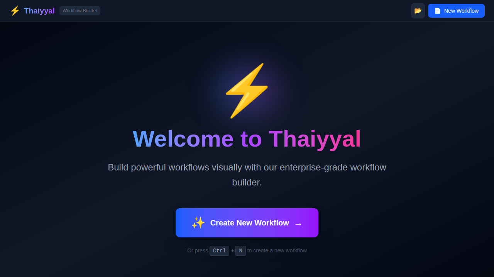
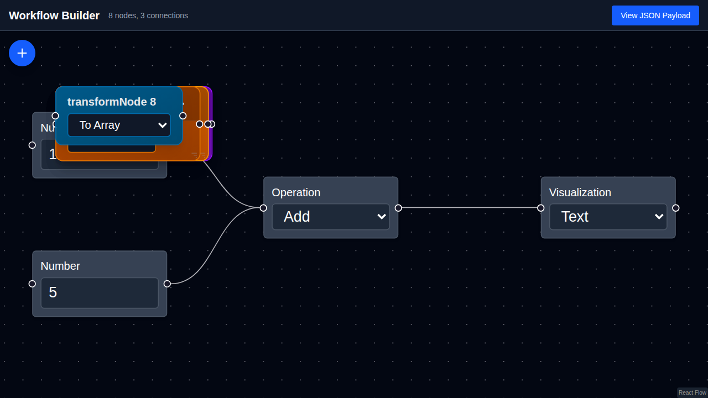

# Thaiyyal

<div align="center">


**A Modern Visual Workflow Builder**

[](https://opensource.org/licenses/MIT)
[](https://nextjs.org/)
[](https://reactjs.org/)
[](https://golang.org/)
[](https://www.typescriptlang.org/)

[Features](#features) • [Quick Start](#quick-start) • [Documentation](#documentation) • [Architecture](#architecture) • [Contributing](#contributing)

</div>

## Overview

Thaiyyal is a powerful, visual workflow builder that enables you to create, edit, and execute complex data workflows through an intuitive drag-and-drop interface. Built with modern web technologies and designed for both simplicity and scalability, Thaiyyal bridges the gap between visual workflow design and robust backend execution.

### What is Thaiyyal?

Thaiyyal (Tamil: தையல், meaning "stitch" or "sew") represents the core concept of connecting different operations together into a cohesive workflow. Like stitching fabric, Thaiyyal allows you to stitch together various data processing nodes to create powerful automation pipelines.

### Key Highlights

- **🎨 Visual Workflow Builder**: Intuitive drag-and-drop interface powered by React Flow
- **⚡ 23 Node Types**: Comprehensive set of nodes for data processing, control flow, and error handling
- **🔄 Real-time JSON Generation**: See your workflow structure as you build
- **🚀 High Performance**: Go-based execution engine for fast workflow processing
- **💾 Local Storage**: Browser-based workflow persistence
- **📱 Responsive Design**: Works seamlessly across desktop and mobile devices
- **🎯 Zero Configuration**: Get started in seconds, no complex setup required

## Features

### Frontend (Visual Builder)

#### Node Categories

<details>
<summary><b>📥 Input / Output Nodes (4 types)</b></summary>

- **Number**: Numeric input values for calculations
- **Text Input**: String inputs for text processing
- **HTTP Request**: Fetch data from external APIs
- **Visualization**: Display and format workflow results

</details>

<details>
<summary><b>⚙️ Operation Nodes (4 types)</b></summary>

- **Math Operation**: Add, subtract, multiply, divide
- **Text Operation**: Uppercase, lowercase, titlecase, camelcase, inversecase, concat, repeat
- **Transform**: Convert data structures (to_array, to_object, flatten, keys, values)
- **Extract**: Extract specific fields from objects

</details>

<details>
<summary><b>🔀 Control Flow Nodes (4 types)</b></summary>

- **Condition**: Conditional branching (>, <, ==, !=, >=, <=)
- **For Each**: Iterate over array elements
- **While Loop**: Loop while condition is true
- **Switch**: Multi-way branching based on value

</details>

<details>
<summary><b>⚡ Parallel & Join Nodes (3 types)</b></summary>

- **Parallel**: Execute multiple branches concurrently
- **Join**: Combine outputs (all/any/first strategies)
- **Split**: Fan-out to multiple paths

</details>

<details>
<summary><b>💾 State & Memory Nodes (4 types)</b></summary>

- **Variable**: Store and retrieve values
- **Cache**: LRU cache with TTL support
- **Accumulator**: Accumulate values (sum, product, concat, array, count)
- **Counter**: Simple counter with increment/decrement/reset

</details>

<details>
<summary><b>🛡️ Error Handling Nodes (3 types)</b></summary>

- **Retry**: Retry with exponential/linear/constant backoff
- **Try-Catch**: Error handling with fallback logic
- **Timeout**: Enforce time limits on operations

</details>

<details>
<summary><b>🔧 Utility Nodes (1 type)</b></summary>

- **Delay**: Pause execution for specified duration

</details>

<details>
<summary><b>🎯 Context Nodes (2 types)</b></summary>

- **Context Variable**: Define workflow-scoped variables
- **Context Constant**: Define workflow-scoped constants

</details>

### Backend (Workflow Engine)

- **🔍 JSON Payload Parsing**: Accepts workflow definitions as JSON
- **📊 DAG Execution**: Topological sorting for correct execution order
- **🧠 Type Inference**: Automatically determines node types from data
- **🔄 Cycle Detection**: Prevents infinite loops
- **⚡ High Performance**: Written in Go for speed and efficiency
- **🧪 Comprehensive Testing**: 142+ test cases covering all functionality

## Quick Start

### Prerequisites

- **Node.js**: 18.x or higher
- **npm**: 8.x or higher
- **Go**: 1.24 or higher (for backend development)

### Installation

1. **Clone the repository**

```bash
git clone https://github.com/yesoreyeram/thaiyyal.git
cd thaiyyal
```

2. **Install dependencies**

```bash
npm install
```

3. **Run the development server**

```bash
npm run dev
```

4. **Open your browser**

Navigate to [http://localhost:3000](http://localhost:3000)

### Building for Production

```bash
npm run build
```

This creates a static export in the `out/` directory, ready for deployment to any static hosting service (GitHub Pages, Netlify, Vercel, etc.).

## Usage

### Creating Your First Workflow

1. **Open Workflow Builder**: Click "Create New Workflow" from the home page
2. **Add Nodes**: Click the + button to open the node palette and select any node type
3. **Connect Nodes**: Drag from the output handle (right) of one node to the input handle (left) of another
4. **Configure Nodes**: Click on a node to edit its properties (values, operations, etc.)
5. **View JSON**: Click "View JSON Payload" to see the generated workflow JSON
6. **Close Palette**: The palette automatically closes after adding a node, or click the X to close manually

### Node Palette Features

- **Collapsible & Floating**: The node palette floats over the canvas and can be toggled on/off
- **Categorized Nodes**: Nodes are organized into 7 categories for easy discovery
- **Hidden by Default**: Starts hidden to maximize canvas space
- **Quick Access**: Click the + button to instantly add nodes

### Example Workflows

#### Simple Calculator (Add Two Numbers)

```
[Number: 10] ──┐
               ├──► [Operation: Add] ──► [Visualization]
[Number: 5]  ──┘
```

#### Text Processing Pipeline

```
[Text Input: "hello world"] ──► [Text Operation: Uppercase] ──► [Visualization]
```

#### Conditional Workflow

```
[Number: 150] ──┐
                ├──► [Condition: > 100] ──true──► [Visualization: "High"]
[Number: 100] ──┘                      └─false─► [Visualization: "Low"]
```

## Screenshots

<div align="center">

### Home Page



The modern home page features:
- **Hero Section**: Welcome message with gradient text and animations
- **Feature Highlights**: Visual cards showcasing key capabilities
- **Quick Actions**: Create new workflow or open existing ones
- **Professional Design**: Dark theme with glassmorphism effects

### Workflow Builder



Advanced workflow builder showing:
- **Collapsible Node Palette**: Floating palette with categorized nodes (hidden by default)
- **Multiple Node Types**: HTTP, Condition, For Each, Transform, and more
- **Dark Theme**: Professional dark interface for comfortable editing
- **Interactive Canvas**: Drag-and-drop workflow building with real-time connections
- **Add Node Button**: Click the + button to open the node palette

</div>

## Documentation

### Core Documentation

- **[README.md](README.md)** - This file, main documentation
- **[ARCHITECTURE.md](ARCHITECTURE.md)** - System architecture and design
- **[ARCHITECTURE_REVIEW.md](ARCHITECTURE_REVIEW.md)** - Detailed architectural analysis

### Backend Documentation

- **[backend/README.md](backend/README.md)** - Backend workflow engine documentation
- **[backend/INTEGRATION.md](backend/INTEGRATION.md)** - Frontend-backend integration guide
- **[backend/REFACTORING_SUMMARY.md](backend/REFACTORING_SUMMARY.md)** - Backend refactoring details

### Frontend Documentation

- **[FRONTEND_TESTS.md](FRONTEND_TESTS.md)** - Frontend test scenarios and implementation
- **[src/app/PAGES_README.md](src/app/PAGES_README.md)** - Page structure documentation

### Additional Resources

- **[docs/NODES.md](docs/NODES.md)** - Complete node type reference
- **[docs/EXAMPLES.md](docs/EXAMPLES.md)** - Workflow examples and patterns
- **[screenshots/README.md](screenshots/README.md)** - Screenshot documentation

## Architecture

### Technology Stack

#### Frontend
- **Framework**: Next.js 16.0.1 (App Router)
- **UI Library**: React 19.2.0
- **Workflow Canvas**: ReactFlow 11.8.0
- **Language**: TypeScript 5
- **Styling**: Tailwind CSS 4
- **State Management**: React Hooks + Local Storage

#### Backend
- **Language**: Go 1.24.7
- **Dependencies**: Standard library only
- **Testing**: Go testing framework
- **Architecture**: DAG-based execution engine

### System Architecture

```
┌─────────────────────────────────────────┐
│         Frontend (Next.js/React)        │
│  ┌───────────┐         ┌──────────────┐ │
│  │  Canvas   │◄────────┤ Node Palette │ │
│  │ (ReactFlow)│         └──────────────┘ │
│  └─────┬─────┘                           │
│        │ generates                       │
│        ▼                                 │
│  ┌──────────────────┐                   │
│  │  JSON Payload    │                   │
│  └────────┬─────────┘                   │
└───────────┼──────────────────────────────┘
            │
            │ HTTP (future)
            ▼
┌───────────────────────────────────────────┐
│      Backend (Go Workflow Engine)         │
│  ┌──────────────────────────────────────┐ │
│  │  Engine                              │ │
│  │  ┌──────────────┐   ┌─────────────┐ │ │
│  │  │ Parse JSON   │──►│ Infer Types │ │ │
│  │  └──────────────┘   └──────┬──────┘ │ │
│  │                            │        │ │
│  │  ┌─────────────────────────▼─────┐ │ │
│  │  │  Topological Sort (DAG)       │ │ │
│  │  └──────────────┬─────────────────┘ │ │
│  │                 │                   │ │
│  │  ┌──────────────▼─────────────────┐ │ │
│  │  │  Execute Nodes in Order        │ │ │
│  │  │  ┌──────────────────────────┐  │ │ │
│  │  │  │ Node Executors (23 types)│  │ │ │
│  │  │  └──────────────────────────┘  │ │ │
│  │  └──────────────┬─────────────────┘ │ │
│  │                 │                   │ │
│  │  ┌──────────────▼─────────────────┐ │ │
│  │  │  Return Results                │ │ │
│  │  └──────────────────────────────────┘ │ │
│  └──────────────────────────────────────┘ │
└───────────────────────────────────────────┘
```

### Key Design Decisions

1. **No External Dependencies (Backend)**: Using only Go's standard library for simplicity and security
2. **Type Inference**: Reduces frontend complexity by inferring node types from data
3. **DAG Execution**: Ensures predictable, deterministic execution using Kahn's algorithm
4. **In-Memory State**: Fast for MVP, suitable for single-workflow scope
5. **Client-Side Persistence**: LocalStorage for browser-based workflow management

## Development

### Project Structure

```
thaiyyal/
├── src/                          # Frontend source
│   ├── app/                      # Next.js pages
│   │   ├── page.tsx              # Home page
│   │   ├── tests/page.tsx        # Test scenarios
│   │   └── pagination-tests/     # Pagination tests
│   ├── components/               # React components
│   │   └── nodes/                # React Flow node components
│   └── types/                    # TypeScript types
├── backend/                      # Go workflow engine
│   ├── workflow.go               # Main engine
│   ├── executor.go               # Node execution dispatcher
│   ├── graph.go                  # Graph algorithms
│   ├── nodes_*.go                # Node executors by category
│   ├── workflow_*_test.go        # Comprehensive tests
│   └── examples/                 # Example usage
├── docs/                         # Documentation
├── screenshots/                  # Visual documentation
├── public/                       # Static assets
└── .github/workflows/            # GitHub Actions workflows
```

### Running Tests

#### Frontend
```bash
npm run lint
```

#### Backend
```bash
cd backend
go test -v                        # Run all tests
go test -v -run TestBasic        # Run specific test suite
go test -cover                    # Test coverage
```

### Adding New Node Types

1. **Frontend**: Add node component in `src/components/nodes/`
2. **Backend**: Implement executor in appropriate `nodes_*.go` file
3. **Add to palette**: Update `nodeCategories` in the workflow page
4. **Write tests**: Add tests in `backend/workflow_*_test.go`

## Deployment

### GitHub Pages (Recommended)

This repository includes a GitHub Actions workflow for automatic deployment to GitHub Pages.

#### Enable GitHub Pages

1. Go to repository **Settings** → **Pages**
2. Under "Build and deployment", select **Source**: "GitHub Actions"
3. The workflow will automatically build and deploy on every push to `main`
4. Your site will be available at: `https://<username>.github.io/<repository-name>/`

#### Manual Deployment

```bash
# Build the static export
npm run build

# The output is in the `out/` directory
# Deploy the contents of `out/` to your hosting service
```

### Other Hosting Options

The static export in `out/` can be deployed to:

- **Netlify**: Drag and drop the `out/` folder
- **Vercel**: Connect your GitHub repository
- **AWS S3**: Upload `out/` contents to an S3 bucket
- **Azure Static Web Apps**: Deploy via GitHub Actions
- **Any static hosting**: Upload the `out/` directory

## Browser Compatibility

- ✅ Chrome 90+
- ✅ Firefox 88+
- ✅ Safari 14+
- ✅ Edge 90+
- ⚠️ IE 11: Not supported

## Performance Considerations

- **Frontend**: Optimized for workflows with up to 100 nodes
- **Backend**: Can handle workflows with thousands of nodes
- **Browser Storage**: LocalStorage limited to ~5-10MB (browser-dependent)

## Security

### Current Security Measures

- ✅ Input validation in node executors
- ✅ Type checking for operations
- ✅ Cycle detection prevents infinite loops
- ✅ Client-side only (no sensitive data sent to server)

### Recommendations for Production

- 🔐 Add timeouts for all operations
- 🔐 Implement URL whitelist for HTTP nodes
- 🔐 Add rate limiting
- 🔐 Input size limits
- 🔐 Execution quotas

See [ARCHITECTURE_REVIEW.md](ARCHITECTURE_REVIEW.md) for detailed security recommendations.

## Roadmap

### Short Term (v0.2)
- [ ] Backend HTTP API for workflow execution
- [ ] Workflow execution history
- [ ] Export workflows as files
- [ ] Import workflows from files

### Medium Term (v0.3)
- [ ] Real-time collaboration
- [ ] Workflow templates library
- [ ] Advanced data visualization
- [ ] Workflow debugging tools

### Long Term (v1.0)
- [ ] Cloud deployment
- [ ] Team workspace
- [ ] Version control for workflows
- [ ] Plugin system for custom nodes

## Contributing

We welcome contributions! Please see our contributing guidelines:

1. **Fork the repository**
2. **Create a feature branch**: `git checkout -b feature/amazing-feature`
3. **Make your changes**
4. **Run tests**: `npm run lint && cd backend && go test ./...`
5. **Commit your changes**: `git commit -m 'Add amazing feature'`
6. **Push to branch**: `git push origin feature/amazing-feature`
7. **Open a Pull Request**

### Development Guidelines

- Follow existing code style and conventions
- Add tests for new features
- Update documentation as needed
- Keep commits focused and atomic
- Write clear commit messages

## License

This project is licensed under the MIT License - see the [LICENSE](LICENSE) file for details.

## Acknowledgments

- **React Flow**: For the excellent visual workflow library
- **Next.js**: For the amazing React framework
- **Go**: For the simple and powerful backend language
- **Community**: For inspiration and feedback

## Support

- **Issues**: [GitHub Issues](https://github.com/yesoreyeram/thaiyyal/issues)
- **Discussions**: [GitHub Discussions](https://github.com/yesoreyeram/thaiyyal/discussions)
- **Documentation**: [Full Documentation](docs/README.md)

## Authors

- **Sriramajeyam Sugumaran** ([@yesoreyeram](https://github.com/yesoreyeram))

---

<div align="center">

**[⬆ Back to Top](#thaiyyal)**

Made with ❤️ by the Thaiyyal Team

</div>
