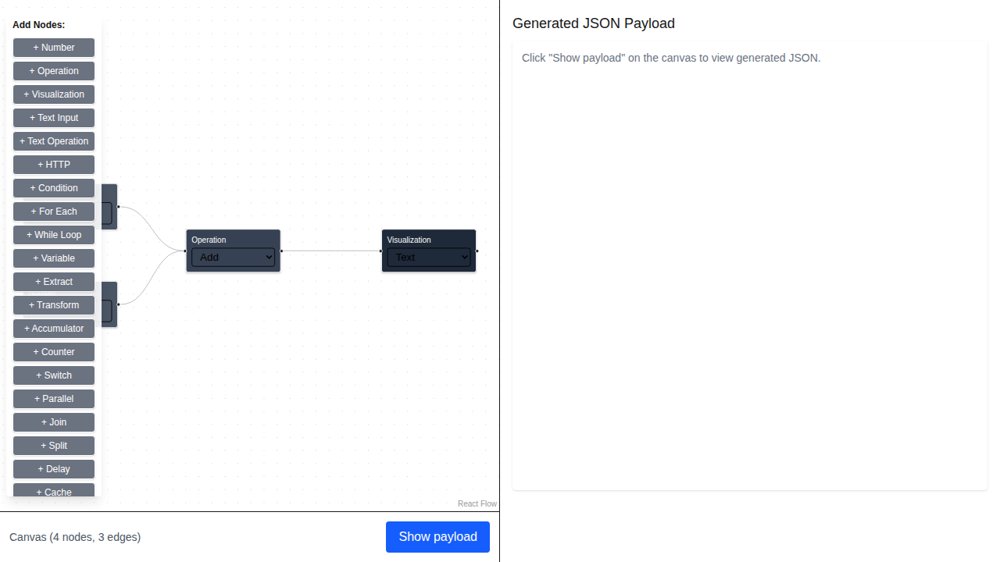
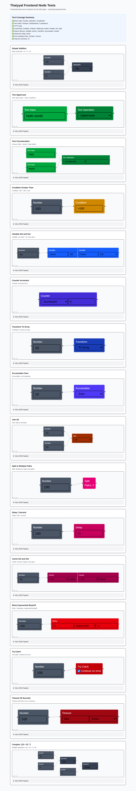

# Thaiyyal — Workflow Builder MVP (Frontend)

This repository contains a very small Next.js + React + TypeScript frontend MVP for a visual workflow builder using React Flow. The app provides a left canvas to compose a minimal workflow (two numeric inputs, an operation node, a visualization node) and a right pane that shows the generated JSON payload.

Quick start

1. Install dependencies

```bash
npm install
```

2. Run the dev server

```bash
npm run dev
```

Open the URL printed by Next (usually http://localhost:3000).

Notes

- The UI is intentionally minimal. Click nodes in the canvas to edit their values (prompts). Use the "Show payload" button to toggle the generated JSON on the right.
- This front-end generates a JSON payload of the form:

```json
{
	"nodes": [{"id": "1", "data": {...}}, ...],
	"edges": [{"id": "e1-3", "source": "1", "target": "3"}, ...]
}
```

## Workflow Scenarios & Screenshots

This section demonstrates various workflow patterns you can build with Thaiyyal. Each scenario shows how to use different node types and combinations to solve common workflow problems.

### Overview



The main application interface provides:
- **Left Panel**: Node palette organized by category (Input/Output, Operations, Control Flow, etc.)
- **Center Canvas**: Visual workflow builder with drag-and-drop nodes
- **Right Panel**: Generated JSON payload viewer

### All Test Scenarios



View all 16 comprehensive test scenarios at once, demonstrating the full range of node capabilities.

---

## Workflow Patterns by Category

### 1. Basic Arithmetic Operations

#### 1.1 Simple Addition
**Description**: Add two numbers together (10 + 5 = 15)

**Nodes Used**:
- 2× Number nodes (inputs: 10, 5)
- 1× Operation node (operation: add)
- 1× Visualization node (display result)

**Use Case**: Basic calculator functionality, summing values

**Screenshot**: See test scenario #1 in the [full test page](screenshots/02-tests-page-full.png)

---

#### 1.2 Subtraction
**Description**: Subtract one number from another (20 - 8 = 12)

**Nodes Used**:
- 2× Number nodes
- 1× Operation node (operation: subtract)
- 1× Visualization node

**Use Case**: Calculate differences, remaining quantities

---

#### 1.3 Multiplication
**Description**: Multiply two numbers (6 × 7 = 42)

**Nodes Used**:
- 2× Number nodes
- 1× Operation node (operation: multiply)
- 1× Visualization node

**Use Case**: Scaling values, calculating areas

---

#### 1.4 Division
**Description**: Divide one number by another (100 ÷ 4 = 25)

**Nodes Used**:
- 2× Number nodes
- 1× Operation node (operation: divide)
- 1× Visualization node

**Use Case**: Splitting quantities, calculating averages

---

#### 1.5 Complex Arithmetic: (10 + 5) × 2
**Description**: Chain multiple operations together

**Nodes Used**:
- 3× Number nodes (10, 5, 2)
- 2× Operation nodes (add, multiply)
- 1× Visualization node

**Use Case**: Complex calculations with operator precedence

**Screenshot**: See test scenario #16 in the [full test page](screenshots/02-tests-page-full.png)

---

### 2. Text Processing

#### 2.1 Text Uppercase
**Description**: Convert text to uppercase (hello world → HELLO WORLD)

**Nodes Used**:
- 1× Text Input node
- 1× Text Operation node (operation: uppercase)
- 1× Visualization node

**Use Case**: Normalize text for comparison, formatting output

**Screenshot**: See test scenario #2 in the [full test page](screenshots/02-tests-page-full.png)

---

#### 2.2 Text Lowercase
**Description**: Convert text to lowercase (HELLO WORLD → hello world)

**Nodes Used**:
- 1× Text Input node
- 1× Text Operation node (operation: lowercase)
- 1× Visualization node

**Use Case**: Normalize user input, case-insensitive matching

---

#### 2.3 Title Case
**Description**: Convert text to title case (hello world → Hello World)

**Nodes Used**:
- 1× Text Input node
- 1× Text Operation node (operation: titlecase)
- 1× Visualization node

**Use Case**: Format titles, proper names

---

#### 2.4 Camel Case
**Description**: Convert text to camelCase (hello world → helloWorld)

**Nodes Used**:
- 1× Text Input node
- 1× Text Operation node (operation: camelcase)
- 1× Visualization node

**Use Case**: Generate variable names, API formatting

---

#### 2.5 Inverse Case
**Description**: Invert the case of each character (Hello → hELLO)

**Nodes Used**:
- 1× Text Input node
- 1× Text Operation node (operation: inversecase)
- 1× Visualization node

**Use Case**: Text obfuscation, special formatting

---

#### 2.6 Text Concatenation
**Description**: Join multiple text inputs with a separator

**Nodes Used**:
- 2× Text Input nodes
- 1× Text Operation node (operation: concat, separator: " ")
- 1× Visualization node

**Use Case**: Build full names, combine strings

**Screenshot**: See test scenario #3 in the [full test page](screenshots/02-tests-page-full.png)

---

#### 2.7 Text Repeat
**Description**: Repeat text multiple times (ha × 3 = hahaha)

**Nodes Used**:
- 1× Text Input node
- 1× Text Operation node (operation: repeat, count: 3)
- 1× Visualization node

**Use Case**: Generate patterns, padding

---

### 3. HTTP Operations

#### 3.1 HTTP GET Request
**Description**: Fetch data from an external API

**Nodes Used**:
- 1× HTTP Request node (URL: https://api.example.com/data)
- 1× Visualization node

**Use Case**: Integrate external data sources, API calls

---

#### 3.2 HTTP with Text Processing
**Description**: Fetch data and transform the response

**Nodes Used**:
- 1× HTTP Request node
- 1× Text Operation node (process response)
- 1× Visualization node

**Use Case**: Clean API responses, extract specific fields

---

### 4. Control Flow - Conditional Branching

#### 4.1 Greater Than Condition
**Description**: Branch based on numeric comparison (150 > 100 = true)

**Nodes Used**:
- 2× Number nodes
- 1× Condition node (operator: >)
- 1× Visualization node (on true branch)

**Use Case**: Threshold checking, validation

**Screenshot**: See test scenario #4 in the [full test page](screenshots/02-tests-page-full.png)

---

#### 4.2 Less Than Condition
**Description**: Check if one value is less than another

**Nodes Used**:
- 2× Number nodes
- 1× Condition node (operator: <)
- 2× Visualization nodes (true/false branches)

**Use Case**: Minimum value checks, filtering

---

#### 4.3 Equal To Condition
**Description**: Check if two values are equal

**Nodes Used**:
- 2× Number nodes
- 1× Condition node (operator: ==)
- 2× Visualization nodes

**Use Case**: Validation, exact matching

---

#### 4.4 Not Equal Condition
**Description**: Check if two values are different

**Nodes Used**:
- 2× Number nodes
- 1× Condition node (operator: !=)
- 2× Visualization nodes

**Use Case**: Change detection, validation

---

#### 4.5 Greater Than or Equal
**Description**: Check if value meets minimum threshold

**Nodes Used**:
- 2× Number nodes
- 1× Condition node (operator: >=)
- 2× Visualization nodes

**Use Case**: Range validation, quota checks

---

#### 4.6 Less Than or Equal
**Description**: Check if value is within limit

**Nodes Used**:
- 2× Number nodes
- 1× Condition node (operator: <=)
- 2× Visualization nodes

**Use Case**: Maximum value validation, capacity checks

---

### 5. Control Flow - Loops

#### 5.1 For Each Loop
**Description**: Iterate over array elements

**Nodes Used**:
- 1× Variable node (set array)
- 1× ForEach node
- 1× Operation node (process each item)
- 1× Visualization node

**Use Case**: Process lists, batch operations

---

#### 5.2 While Loop
**Description**: Loop while condition is true

**Nodes Used**:
- 1× Counter node (initialize)
- 1× WhileLoop node (condition: counter < 10)
- 1× Counter node (increment)
- 1× Visualization node

**Use Case**: Conditional iteration, dynamic loops

---

### 6. Control Flow - Advanced

#### 6.1 Switch Statement
**Description**: Multi-way branching based on value

**Nodes Used**:
- 1× Number node (input value)
- 1× Switch node (cases: 1, 2, 3, default)
- 4× Visualization nodes (one per case)

**Use Case**: State machines, menu selection

---

#### 6.2 Parallel Execution
**Description**: Execute multiple branches concurrently

**Nodes Used**:
- 1× Number node (input)
- 1× Parallel node
- 3× Operation nodes (different operations)
- 1× Join node (combine results)
- 1× Visualization node

**Use Case**: Concurrent processing, performance optimization

---

#### 6.3 Join All Inputs
**Description**: Wait for all inputs before proceeding

**Nodes Used**:
- 3× Number nodes
- 1× Join node (strategy: all)
- 1× Visualization node

**Use Case**: Synchronization, combining multiple sources

**Screenshot**: See test scenario #9 in the [full test page](screenshots/02-tests-page-full.png)

---

#### 6.4 Join Any Input
**Description**: Proceed when any input is ready

**Nodes Used**:
- 3× HTTP nodes (different APIs)
- 1× Join node (strategy: any)
- 1× Visualization node

**Use Case**: Race conditions, fastest response

---

#### 6.5 Join First Input
**Description**: Use the first input that arrives

**Nodes Used**:
- 3× HTTP nodes
- 1× Join node (strategy: first)
- 1× Visualization node

**Use Case**: Failover, redundancy

---

#### 6.6 Split to Multiple Paths
**Description**: Distribute data to multiple downstream paths

**Nodes Used**:
- 1× Number node
- 1× Split node
- 3× Operation nodes (different transformations)
- 3× Visualization nodes

**Use Case**: Data distribution, fan-out pattern

**Screenshot**: See test scenario #10 in the [full test page](screenshots/02-tests-page-full.png)

---

### 7. State & Memory Management

#### 7.1 Variable Set and Get
**Description**: Store a value and retrieve it later

**Nodes Used**:
- 1× Number node
- 1× Variable node (operation: set, name: myVar)
- 1× Variable node (operation: get, name: myVar)
- 1× Visualization node

**Use Case**: Data persistence, sharing data between nodes

**Screenshot**: See test scenario #5 in the [full test page](screenshots/02-tests-page-full.png)

---

#### 7.2 Counter Increment
**Description**: Maintain and increment a counter

**Nodes Used**:
- 1× Counter node (operation: increment, step: 5)
- 1× Visualization node

**Use Case**: Iteration tracking, unique ID generation

**Screenshot**: See test scenario #6 in the [full test page](screenshots/02-tests-page-full.png)

---

#### 7.3 Counter Decrement
**Description**: Decrement a counter value

**Nodes Used**:
- 1× Counter node (initial: 100, operation: decrement, step: 10)
- 1× Visualization node

**Use Case**: Countdown, resource tracking

---

#### 7.4 Accumulator Sum
**Description**: Accumulate numeric values (sum)

**Nodes Used**:
- 3× Number nodes
- 1× Accumulator node (operation: sum)
- 1× Visualization node

**Use Case**: Total calculations, aggregation

**Screenshot**: See test scenario #8 in the [full test page](screenshots/02-tests-page-full.png)

---

#### 7.5 Accumulator Product
**Description**: Multiply accumulated values

**Nodes Used**:
- 3× Number nodes
- 1× Accumulator node (operation: product)
- 1× Visualization node

**Use Case**: Factorial calculations, compound growth

---

#### 7.6 Accumulator Concatenate
**Description**: Concatenate string values

**Nodes Used**:
- 3× Text Input nodes
- 1× Accumulator node (operation: concat)
- 1× Visualization node

**Use Case**: Build strings, log aggregation

---

#### 7.7 Accumulator Array
**Description**: Collect values into an array

**Nodes Used**:
- 3× Number nodes
- 1× Accumulator node (operation: array)
- 1× Visualization node

**Use Case**: List building, batch collection

---

### 8. Data Transformation

#### 8.1 Extract Object Fields
**Description**: Extract specific fields from an object

**Nodes Used**:
- 1× HTTP node (returns object)
- 1× Extract node (fields: name, age)
- 1× Visualization node

**Use Case**: Parse JSON, select specific data

---

#### 8.2 Transform to Array
**Description**: Convert data structure to array

**Nodes Used**:
- 1× Variable node (object data)
- 1× Transform node (operation: to_array)
- 1× Visualization node

**Use Case**: Data normalization, iteration preparation

**Screenshot**: See test scenario #7 in the [full test page](screenshots/02-tests-page-full.png)

---

#### 8.3 Transform to Object
**Description**: Convert array to object structure

**Nodes Used**:
- 1× Variable node (array data)
- 1× Transform node (operation: to_object)
- 1× Visualization node

**Use Case**: Data restructuring, key-value mapping

---

#### 8.4 Flatten Nested Structure
**Description**: Flatten nested arrays/objects

**Nodes Used**:
- 1× Variable node (nested data)
- 1× Transform node (operation: flatten)
- 1× Visualization node

**Use Case**: Simplify data structures, denormalization

---

#### 8.5 Extract Keys
**Description**: Get all keys from an object

**Nodes Used**:
- 1× Variable node (object)
- 1× Transform node (operation: keys)
- 1× Visualization node

**Use Case**: Schema inspection, property enumeration

---

#### 8.6 Extract Values
**Description**: Get all values from an object

**Nodes Used**:
- 1× Variable node (object)
- 1× Transform node (operation: values)
- 1× Visualization node

**Use Case**: Data extraction, value collection

---

### 9. Advanced Features

#### 9.1 Delay Execution
**Description**: Pause workflow for specified duration (1 second)

**Nodes Used**:
- 1× Number node
- 1× Delay node (duration: 1s)
- 1× Visualization node

**Use Case**: Rate limiting, scheduled execution

**Screenshot**: See test scenario #11 in the [full test page](screenshots/02-tests-page-full.png)

---

#### 9.2 Cache Set and Get
**Description**: Cache data with TTL

**Nodes Used**:
- 1× Number node
- 1× Cache node (operation: set, key: mykey, TTL: 3600)
- 1× Cache node (operation: get, key: mykey)
- 1× Visualization node

**Use Case**: Performance optimization, temporary storage

**Screenshot**: See test scenario #12 in the [full test page](screenshots/02-tests-page-full.png)

---

#### 9.3 Cache Delete
**Description**: Remove cached data

**Nodes Used**:
- 1× Cache node (operation: delete, key: mykey)
- 1× Visualization node

**Use Case**: Cache invalidation, cleanup

---

### 10. Error Handling & Resilience

#### 10.1 Retry with Exponential Backoff
**Description**: Retry failed operations with increasing delays

**Nodes Used**:
- 1× HTTP node (may fail)
- 1× Retry node (attempts: 3, strategy: exponential, base_delay: 1s)
- 1× Visualization node

**Use Case**: Handle transient failures, API resilience

**Screenshot**: See test scenario #13 in the [full test page](screenshots/02-tests-page-full.png)

---

#### 10.2 Retry with Linear Backoff
**Description**: Retry with fixed delay increments

**Nodes Used**:
- 1× HTTP node
- 1× Retry node (attempts: 3, strategy: linear, base_delay: 2s)
- 1× Visualization node

**Use Case**: Predictable retry timing, load management

---

#### 10.3 Retry with Constant Delay
**Description**: Retry with same delay each time

**Nodes Used**:
- 1× HTTP node
- 1× Retry node (attempts: 5, strategy: constant, delay: 1s)
- 1× Visualization node

**Use Case**: Simple retry logic, polling

---

#### 10.4 Try-Catch Error Handling
**Description**: Handle errors with fallback logic

**Nodes Used**:
- 1× HTTP node (may fail - try branch)
- 1× Text Input node (fallback - catch branch)
- 1× TryCatch node
- 1× Visualization node

**Use Case**: Graceful degradation, error recovery

**Screenshot**: See test scenario #14 in the [full test page](screenshots/02-tests-page-full.png)

---

#### 10.5 Timeout Enforcement
**Description**: Limit execution time (30 seconds)

**Nodes Used**:
- 1× HTTP node (slow operation)
- 1× Timeout node (duration: 30s, on_timeout: error)
- 1× Visualization node

**Use Case**: Prevent hanging, SLA enforcement

**Screenshot**: See test scenario #15 in the [full test page](screenshots/02-tests-page-full.png)

---

## Additional Resources

- **Test Page**: Visit `http://localhost:3000/tests` to see all scenarios in action
- **Frontend Tests Documentation**: See [FRONTEND_TESTS.md](FRONTEND_TESTS.md) for detailed implementation notes
- **Screenshots Directory**: See [screenshots/README.md](screenshots/README.md) for more information

---

Next steps (suggested)

- Add Tailwind/PostCSS build wiring if you want to use Tailwind utilities fully.
- Add a simple API route to accept the generated payload and evaluate or persist workflows.
