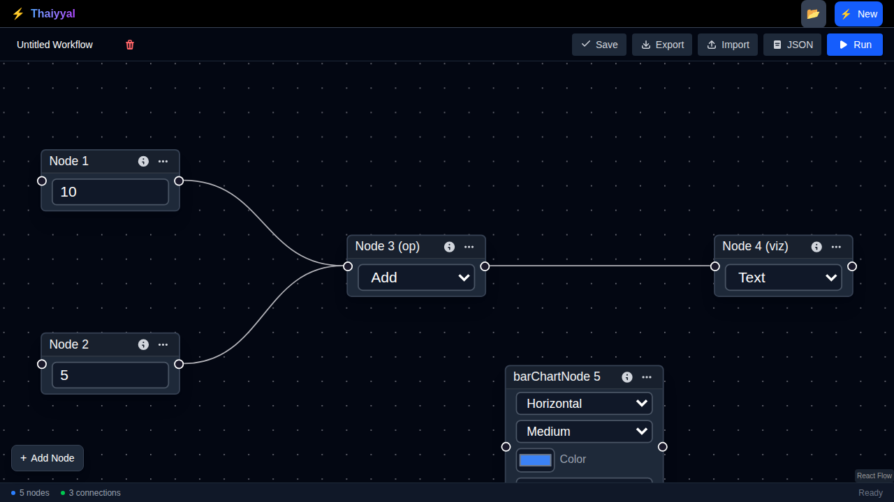
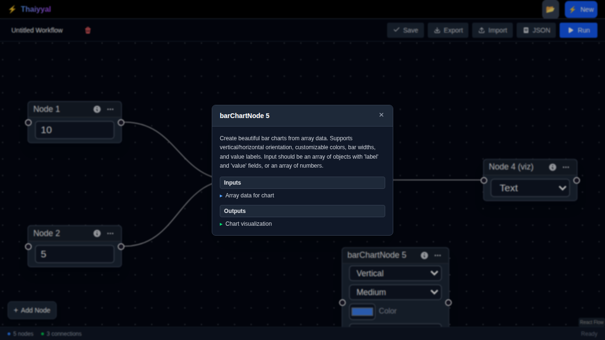

# Bar Chart Visualization Node

## Overview

The **Bar Chart Node** is a visualization component that creates beautiful, customizable bar charts from array data. It provides extensive configuration options for chart appearance including orientation, colors, bar widths, and value labels.

## Node Type

- **Type**: `barChartNode`
- **Category**: Input/Output (Visualization)
- **Color**: Violet (`bg-violet-600`)

## Configuration Options

### 1. Chart Orientation

Controls whether bars are displayed vertically or horizontally.

- **Field**: `orientation`
- **Type**: Dropdown selection
- **Options**:
  - `vertical` (default) - Bars extend upward from bottom
  - `horizontal` - Bars extend rightward from left
- **Use Cases**:
  - **Vertical**: Best for time series, comparisons with shorter labels
  - **Horizontal**: Better for long category names, rankings

### 2. Bar Width

Sets the thickness of individual bars in the chart.

- **Field**: `bar_width`
- **Type**: Dropdown selection
- **Options**:
  - `thin` - Narrow bars, good for many data points
  - `medium` (default) - Balanced appearance
  - `thick` - Wide bars, emphasizes individual values
- **Use Cases**:
  - **Thin**: 20+ data points, dense comparisons
  - **Medium**: 5-20 data points, general purpose
  - **Thick**: 2-10 data points, focus on specific values

### 3. Bar Color

Customizes the color of all bars in the chart.

- **Field**: `bar_color`
- **Type**: Color picker
- **Default**: `#3b82f6` (Blue 500)
- **Format**: Hex color code
- **Examples**:
  - `#3b82f6` - Blue (default)
  - `#10b981` - Green (success)
  - `#ef4444` - Red (errors/alerts)
  - `#f59e0b` - Amber (warnings)
  - `#8b5cf6` - Purple (special metrics)

### 4. Maximum Bars

Limits the number of bars displayed to prevent overcrowding.

- **Field**: `max_bars`
- **Type**: Number input
- **Default**: `20`
- **Range**: 1-100
- **Behavior**: 
  - If input array has more items than `max_bars`, only the first N items are displayed
  - Useful for large datasets where you want to show "top N" results
  - Can be combined with Sort node to show top/bottom performers

### 5. Show Values

Toggle display of numeric values on or near each bar.

- **Field**: `show_values`
- **Type**: Checkbox
- **Default**: `true` (checked)
- **When Enabled**: Displays the numeric value for each bar
- **When Disabled**: Shows only the visual bar representation
- **Use Cases**:
  - **Enabled**: Precise comparisons, reports, dashboards
  - **Disabled**: Clean visualizations, trend overview, presentations

## Input Data Format

The Bar Chart Node accepts array data in multiple formats:

### Format 1: Array of Objects (Recommended)

```json
[
  { "label": "Product A", "value": 150 },
  { "label": "Product B", "value": 230 },
  { "label": "Product C", "value": 180 },
  { "label": "Product D", "value": 290 }
]
```

**Required Fields**:
- `label` (string): The category/name for the bar
- `value` (number): The numeric value to visualize

**Optional Fields**:
- Any additional fields are ignored but preserved in the data

### Format 2: Array of Numbers

```json
[150, 230, 180, 290, 120]
```

**Behavior**: 
- Labels are auto-generated as "Item 1", "Item 2", etc.
- Values are taken from the array directly

### Format 3: Complex Objects with Nested Values

```json
[
  { "name": "Sales Q1", "metrics": { "revenue": 45000 } },
  { "name": "Sales Q2", "metrics": { "revenue": 52000 } }
]
```

**Note**: Use the **Extract** or **Transform** node first to convert to Format 1

## Output Format

The Bar Chart Node outputs an object containing:

```json
{
  "type": "bar_chart",
  "data": [...input data...],
  "config": {
    "orientation": "vertical",
    "bar_color": "#3b82f6",
    "bar_width": "medium",
    "show_values": true,
    "max_bars": 20
  },
  "metadata": {
    "total_items": 15,
    "displayed_items": 15,
    "truncated": false
  }
}
```

## Common Use Cases

### 1. Sales Performance Dashboard

**Workflow**: HTTP → Extract → Sort → Bar Chart

```
HTTP Request (Sales API)
  ↓
Extract (by product)
  ↓
Sort (by revenue, descending)
  ↓
Bar Chart (top 10 products)
  - orientation: vertical
  - bar_color: #10b981 (green)
  - max_bars: 10
  - show_values: true
```

### 2. Error Rate Comparison

**Workflow**: Multiple HTTP → Join → Bar Chart

```
API 1 (errors)  →  \
API 2 (errors)  →  → Join → Transform → Bar Chart
API 3 (errors)  →  /
```

**Configuration**:
- orientation: horizontal (for service names)
- bar_color: #ef4444 (red for errors)
- bar_width: thick
- show_values: true

### 3. Time Series Data

**Workflow**: HTTP → Filter → Bar Chart

```
HTTP Request (metrics API)
  ↓
Filter (last 24 hours)
  ↓
Bar Chart (hourly breakdown)
  - orientation: vertical
  - bar_color: #3b82f6 (blue)
  - max_bars: 24
  - bar_width: thin
```

### 4. Survey Results

**Workflow**: HTTP → Group By → Map → Bar Chart

```
HTTP (survey responses)
  ↓
Group By (rating)
  ↓
Map (count per rating)
  ↓
Bar Chart
  - orientation: horizontal
  - bar_color: #8b5cf6 (purple)
  - show_values: true
```

## Integration Examples

### Example 1: Top 5 Products by Revenue

```json
// Workflow Configuration
{
  "nodes": [
    {
      "id": "1",
      "type": "httpNode",
      "data": { "url": "https://api.example.com/products" }
    },
    {
      "id": "2",
      "type": "sortNode",
      "data": { "field": "revenue", "order": "desc" }
    },
    {
      "id": "3",
      "type": "barChartNode",
      "data": {
        "orientation": "vertical",
        "bar_color": "#10b981",
        "bar_width": "medium",
        "max_bars": 5,
        "show_values": true
      }
    }
  ],
  "edges": [
    { "source": "1", "target": "2" },
    { "source": "2", "target": "3" }
  ]
}
```

### Example 2: User Activity Heatmap

```json
// Daily active users for past 30 days
{
  "nodes": [
    {
      "id": "analytics",
      "type": "httpNode",
      "data": { "url": "https://api.example.com/analytics/daily" }
    },
    {
      "id": "slice",
      "type": "sliceNode",
      "data": { "start": 0, "end": 30 }
    },
    {
      "id": "chart",
      "type": "barChartNode",
      "data": {
        "orientation": "vertical",
        "bar_color": "#f59e0b",
        "bar_width": "thin",
        "max_bars": 30,
        "show_values": false
      }
    }
  ]
}
```

### Example 3: Department Budget Comparison

```json
// Horizontal bars for better label readability
{
  "nodes": [
    {
      "id": "budget_data",
      "type": "httpNode",
      "data": { "url": "https://api.example.com/budgets" }
    },
    {
      "id": "chart",
      "type": "barChartNode",
      "data": {
        "orientation": "horizontal",
        "bar_color": "#3b82f6",
        "bar_width": "thick",
        "max_bars": 20,
        "show_values": true
      }
    }
  ]
}
```

## Best Practices

### 1. Data Preparation

✅ **DO**:
- Use **Sort** node before Bar Chart to order data meaningfully
- Use **Filter** node to remove null/invalid values
- Use **Slice** node to limit data to relevant range
- Use **Transform** node to convert complex objects to `{label, value}` format

❌ **DON'T**:
- Pass unsorted data for top/bottom N charts
- Include null or undefined values
- Send extremely large arrays without limiting

### 2. Visual Design

✅ **DO**:
- Use **vertical** orientation for time series and trends
- Use **horizontal** orientation for long labels or rankings
- Choose **contrasting colors** for better visibility
- Enable **show_values** for precise data
- Set appropriate **max_bars** (typically 5-20)

❌ **DON'T**:
- Display more than 30 bars (becomes unreadable)
- Use similar colors for different chart types
- Disable values when precise numbers matter

### 3. Performance

✅ **DO**:
- Limit input arrays with **max_bars** setting
- Pre-filter data upstream in the workflow
- Use **Slice** node for pagination

❌ **DON'T**:
- Send 100+ item arrays without limiting
- Recalculate chart on every minor data change

## Accessibility

The Bar Chart Node is designed with accessibility in mind:

- ✅ All controls have ARIA labels
- ✅ Color picker is keyboard accessible
- ✅ Dropdown menus support keyboard navigation
- ✅ Checkbox has proper labeling
- ✅ Number input validates min/max ranges

## Troubleshooting

### Issue: No bars displayed

**Possible Causes**:
1. Input is not an array
2. Array is empty
3. Objects missing `value` field
4. `max_bars` is set to 0

**Solutions**:
- Verify input with **Visualization** node in "table" mode
- Check upstream nodes for data issues
- Use **Transform** node to ensure correct format

### Issue: Bars are too small/large

**Solutions**:
- Adjust **bar_width** setting (thin/medium/thick)
- Reduce **max_bars** for wider bars
- Use **horizontal** orientation for better space utilization

### Issue: Labels are cut off

**Solutions**:
- Switch to **horizontal** orientation for long labels
- Reduce **max_bars** to give more space per item
- Truncate labels upstream with **Map** or **Transform** node

### Issue: Colors not matching design system

**Solutions**:
- Use color picker to match exact hex codes
- Common Tailwind colors:
  - Blue: `#3b82f6`
  - Green: `#10b981`
  - Red: `#ef4444`
  - Amber: `#f59e0b`
  - Purple: `#8b5cf6`

## Advanced Patterns

### Pattern 1: Multi-Chart Dashboard

Create multiple bar charts with different metrics:

```
HTTP (API) → Split → [Chart 1: Revenue]
                  → [Chart 2: Users]
                  → [Chart 3: Orders]
```

### Pattern 2: Conditional Coloring

Use **Switch** or **Condition** nodes to route to different colored charts:

```
HTTP → Condition (type === 'sales') → Bar Chart (green)
                                    → Bar Chart (red) [for errors]
```

### Pattern 3: Dynamic Max Bars

Use **Variable** node to make max_bars configurable:

```
Variable (user_limit) → Bar Chart (max_bars from variable)
```

## Screenshots

### Default Configuration (Vertical)


The default bar chart configuration showing:
- Vertical orientation
- Medium bar width
- Blue color (#3b82f6)
- Values displayed
- 20 bars maximum

### Horizontal Orientation


Bar chart configured for horizontal display, ideal for:
- Long category labels
- Rankings and leaderboards
- Department comparisons

### Node Information Dialog


The node information popup showing:
- Detailed description
- Input requirements
- Output format
- Usage guidelines

## Related Nodes

### Upstream Nodes (Data Preparation)
- **HTTP Node**: Fetch data from APIs
- **Sort Node**: Order data before visualization
- **Filter Node**: Remove unwanted data points
- **Slice Node**: Limit to specific range
- **Transform Node**: Convert to required format
- **Extract Node**: Pull specific fields from objects
- **Group By Node**: Aggregate data by category
- **Map Node**: Transform each array element

### Downstream Nodes
- **Visualization Node**: Additional rendering options
- **Variable Node**: Store chart configuration

### Alternative Visualization Nodes
- **Visualization Node**: Text and table display modes
- *(Future)* Line Chart Node: For trends over time
- *(Future)* Pie Chart Node: For proportional data
- *(Future)* Scatter Plot Node: For correlation analysis

## API Reference

### Node Data Structure

```typescript
type BarChartNodeData = {
  label?: string;              // Node title (default: "Bar Chart")
  bar_color?: string;          // Hex color (default: "#3b82f6")
  bar_width?: "thin" | "medium" | "thick";  // Bar thickness
  show_values?: boolean;       // Display values on bars
  max_bars?: number;           // Maximum bars to display (1-100)
  orientation?: "vertical" | "horizontal";  // Chart direction
};
```

### Input Schema

```typescript
// Preferred format
type BarChartInput = Array<{
  label: string;
  value: number;
  [key: string]: any;  // Additional fields preserved
}>;

// Alternative format
type BarChartInputSimple = number[];
```

### Output Schema

```typescript
type BarChartOutput = {
  type: "bar_chart";
  data: BarChartInput;
  config: {
    orientation: "vertical" | "horizontal";
    bar_color: string;
    bar_width: "thin" | "medium" | "thick";
    show_values: boolean;
    max_bars: number;
  };
  metadata: {
    total_items: number;
    displayed_items: number;
    truncated: boolean;
  };
};
```

## Version History

| Version | Date | Changes |
|---------|------|---------|
| 1.0.0 | 2024-11-02 | Initial release with core features |

## Future Enhancements

Planned features for future versions:

- [ ] Stacked bar charts (multiple series)
- [ ] Custom color palettes per bar
- [ ] Animation on data updates
- [ ] Axis labels and titles
- [ ] Grid lines and reference lines
- [ ] Export to image (PNG/SVG)
- [ ] Tooltip on hover
- [ ] Click interactions to trigger downstream nodes
- [ ] Logarithmic scale option
- [ ] Negative value support (bidirectional bars)

## Contributing

To contribute improvements to the Bar Chart Node:

1. Update the component in `src/components/nodes/BarChartNode.tsx`
2. Add tests for new features
3. Update this documentation
4. Add screenshots showing new functionality
5. Submit a pull request

## Support

For issues or questions:
- Check the [Troubleshooting](#troubleshooting) section
- Review [examples](#integration-examples)
- Open an issue on GitHub
- Consult main [NODES.md](./NODES.md) documentation

---

**Last Updated**: 2024-11-02  
**Maintainer**: Thaiyyal Team  
**License**: MIT
